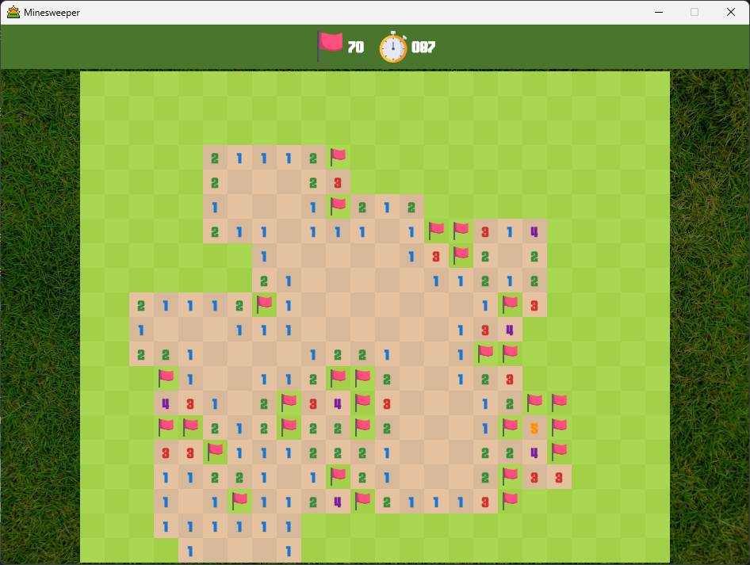

# compose-minesweeper

A minesweeper game development with Kotlin Multiplatform, Compose Multiplatform and SQLDelight for desktop and Android.




## Run desktop application

```
./gradlew run
```

## Image resource

- [pixabay](https://pixabay.com/)
- [flaticon](https://www.flaticon.com/)
